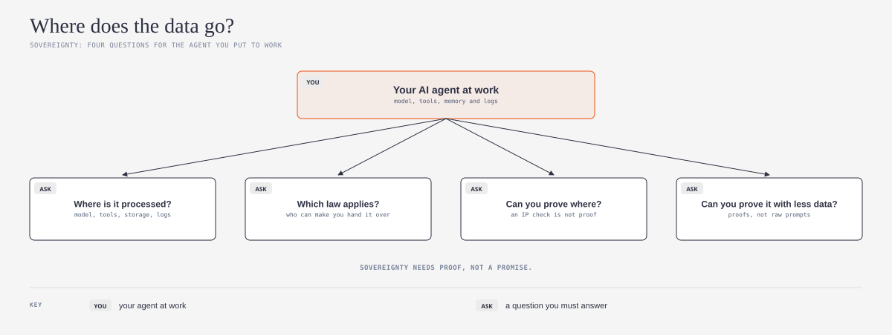
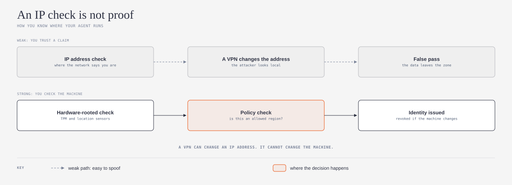
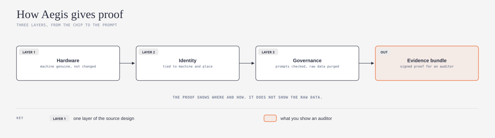

# aegis-sovereign-ai-explained

## What is it?

This repository is a plain-language guide and an agent skill about data sovereignty for AI agents. Both are based on AegisSovereignAI, an open design and reference implementation. AegisSovereignAI shows how to prove where an AI workload ran, on which machine, and under which policy. This guide changes those ideas into four questions that a small team can answer for its own agent.



*Do you want the technical words in plain English? Refer to the [Jargon Buster](JARGON.md).*

## What problem does it solve?

An AI agent sends data to a model, to tools, to storage, and to logs. Each of these can be in a different country, under a different law. Many teams know only what their providers tell them. AegisSovereignAI shows that a location check from an IP address is easy to spoof with a VPN. This guide helps you find where your data goes, and what proof you have for each answer.

## Who is it for?

This guide is for small teams, teams that grow quickly, and solo builders who put AI agents into real work. You do not need to be a specialist in risk, cybersecurity, governance, or safety. For example, an agent that reads customer messages, uses personal data, or works for a client in a different country. You do not need special hardware to use the skill. The skill uses the open [Agent Skills](https://agentskills.io) format (`SKILL.md`), so it works with Claude, Codex, GitHub Copilot, and other AI agents that support this format.

The source project is for large, regulated organizations, for example banks and hospitals. Its reference implementation needs a Linux machine with a TPM 2.0 chip. This guide uses its ideas as questions. It does not tell you to install the source project. If your agent handles regulated data, the source project shows what strong proof looks like.

## Safe by default

1. **Read and draft first.** The skill reads your project and writes a draft data map. It does not change files, settings, or providers before you approve.
2. **No secret keys in the chat.** The skill never asks for a private key, a token, or a password. Do not paste them into the chat.
3. **Honest results.** The skill marks each answer as proof, a provider statement, or unknown. It does not say that your agent is "sovereign" when the proof is missing.
4. **Your files stay yours.** The draft goes into your project folder. You can read, change, or delete it at any time.

## What does it do?

Ask your AI agent to do a sovereignty check. The skill helps your AI agent to do these steps:

1. Make a list of each place where the data of your agent goes
2. Record the region and the company for each place
3. Record the law that applies to each place, and the unknown answers
4. Find the type of proof that you have for each location
5. Find logs that keep raw prompts or personal data
6. Write a draft data map with the gaps, in order of risk

The skill also looks for three frequent mistakes. The first mistake is to use an IP address check as proof of location. The second mistake is to keep raw prompts with personal data "for the audit". The third mistake is to forget the tools and logs, and to check only the model provider.

## How does it work?

*The diagrams below use the visual language of [cathrynlavery/diagram-design](https://github.com/cathrynlavery/diagram-design):*



AegisSovereignAI compares two ways to know the location of a workload. An IP address check trusts what the network says, and a VPN can change it. A hardware-rooted check reads the TPM chip and location sensors of the machine. A policy then checks the region before the workload gets an identity. If the state of the machine changes, the identity is revoked.



The source design has three layers. Layer 1 proves that the machine is genuine and not changed. Layer 2 ties the identity of the workload to that machine and to an allowed place. Layer 3 checks prompts and outputs, makes a proof, and then purges the raw data. The result is a signed evidence bundle that an auditor can check without the raw data.

The source does not cover one part of the "which law applies?" question: who can make a provider hand over data. That part comes from me, not from the source. The skill records it as a question for your providers.

## How to install

First, make a folder with the name `sovereignty-check`. Put `SKILL.md` from this repository in that folder. Then do the steps for your AI agent.

### One command for all agents

If you have Node.js, run this command in a terminal. The command installs the skill for Claude Code, Codex, GitHub Copilot, and other agents.

```
npx skills add ams-builds/aegis-sovereign-ai-explained
```

To get the latest version later, run `npx skills update`. The command uses [skills](https://github.com/vercel-labs/skills) by [Vercel](https://github.com/vercel-labs). If you do not use a terminal, use the instructions for your agent below.

### Claude

1. In claude.ai or the Claude desktop app, make a zip file of the `sovereignty-check` folder.
2. Upload the zip file in **Settings > Capabilities > Skills**.
3. In Claude Code, put the folder in `~/.claude/skills/sovereignty-check/`.

### Codex

1. Put the folder in `~/.agents/skills/sovereignty-check/` for all your projects.
2. Or, put the folder in `.agents/skills/sovereignty-check/` in one project.
3. Or, tell Codex to use `$skill-installer` with the GitHub URL of this repository.
4. If the skill does not show, start Codex again. Source: [Codex skills documentation](https://learn.chatgpt.com/docs/build-skills).

### GitHub Copilot

1. Put the folder in `~/.copilot/skills/sovereignty-check/` for all your projects.
2. Or, put the folder in `.github/skills/sovereignty-check/` in one repository.
3. Use Copilot in agent mode. Source: [GitHub Copilot skills documentation](https://docs.github.com/en/copilot/how-tos/copilot-cli/customize-copilot/create-skills).

These three agents are the most used AI coding agents in the [JetBrains 2026 survey](https://blog.jetbrains.com/research/2026/08/ai-coding-agent-adoption-2026/). Other agents that support Agent Skills use the same `SKILL.md` file. Refer to the documentation of your agent for the folder.

## How to use it

After you install the skill, speak to your AI agent in your usual words:

- "Where does the data of my agent go?"
- "Do a sovereignty check on my agent"
- "Which country processes the prompts of my agent?"

The skill starts automatically. You do not need to use its name.

## Credit and license

This guide is based on [AegisSovereignAI](https://github.com/lfedgeai/AegisSovereignAI), a project of [InfiniEdge AI](https://github.com/lfedgeai) at LF Edge. Its main contributor is [ramkri123](https://github.com/ramkri123). This guide explains the source at commit `0917127` (30 August 2026), with the Hybrid Cloud PoC at version 0.2.0. That project uses the Apache License 2.0. This repository uses the same license. Refer to [LICENSE](LICENSE) and [NOTICE](NOTICE).

This is an independent plain-language guide. It is not an official part of the source project. For the full design, use the source documents.

Changes from the source:

1. I wrote the main concepts again in Simplified Technical English, for readers who are not specialists.
2. I changed the enterprise use cases into four questions for a small team. The four questions and the data-map method come from me.
3. I made three new diagrams.
4. I wrote an agent skill that applies the questions to one agent.
5. I did not copy the code, the proofs, or the PoC. The skill refers to the source documents by their file paths.

**Language.** I wrote the text in Simplified Technical English (ASD-STE100). The idea to ask an AI model to write in ASD-STE100 comes from [Andrej Karpathy](https://github.com/karpathy) ([his post on X](https://x.com/karpathy/status/2105819303471976479)). I used the [simplified-technical-english](https://github.com/0xpili/simplified-technical-english) agent skill by [pili](https://github.com/0xpili) to write and check the text. ASD-STE100 is a specification of ASD (AeroSpace and Defence Industries Association of Europe). This repository is not related to ASD.

---

*New words? The [Jargon Buster](JARGON.md) gives plain-English explanations of data residency, jurisdiction, attestation, TPM, evidence bundle, and more.*
